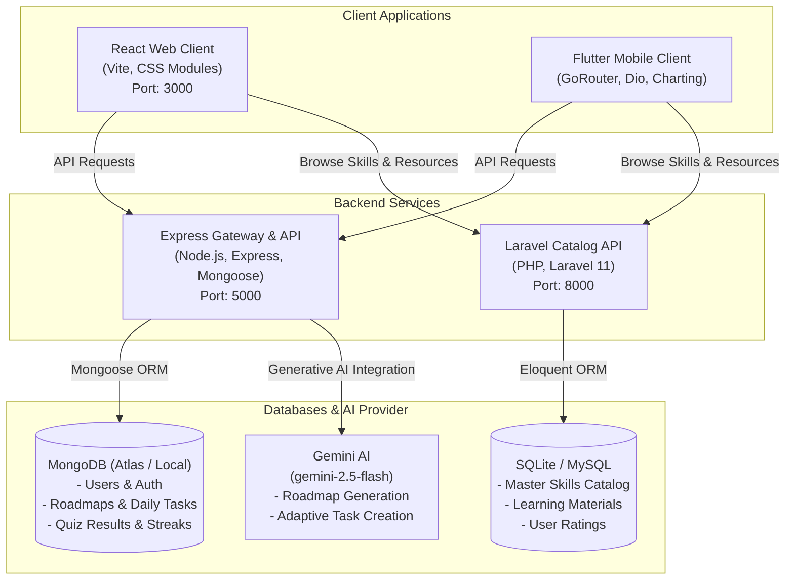

# CareerPilot 🚀
### AI-Powered Career Roadmap & Skill Progression Platform (Prototype)

CareerPilot is an intelligent career guidance and skill progression prototype platform. It generates customized, multi-phase learning roadmaps using Gemini AI, guides users via daily gamified tasks, verifies knowledge acquisition with phase-gated quizzes, and hosts a master catalog of learning resources.

This repository is a monorepo containing the frontend web application, cross-platform mobile application, primary Express backend gateway, and Laravel catalog service.

---

## 🏗️ System Architecture

The CareerPilot ecosystem consists of two frontends, two backends, a MongoDB instance, and SQLite/MySQL databases:



---

## ✨ Core Features

*   **🤖 AI-Powered Roadmaps**: Generates custom, interactive, multi-phase learning paths based on a user's target career, skill level, duration, and interests using Gemini AI.
*   **🎮 Gamified Daily Tasks**: Schedules structured reading, coding, and practice tasks daily. Completing tasks earns the user XP, increments streaks, and tracks progress.
*   **🛡️ Phase-Gating & Quizzes**: Locks subsequent phases in the roadmap until the user completes and passes a randomized validation quiz. Protects against brute-forcing with retake cooldown timers.
*   **📚 Centralized Resource Directory**: Hosts a repository of learning materials categorized by skill, allowing user rating (1–5 stars) and administrator verifications or deprecation flags.
*   **📱 Multi-Client Support**: Unified experiences across a responsive React Single Page Application (SPA) and an animated Flutter Mobile Application.

---

## 📂 Project Directory Structure

```text
├── careerpilot-laravel/    # PHP Laravel backend managing the master catalog of skills/resources
├── docs/                   # Product documents (SRS PDF, API route definitions Markdown)
├── mobile/                 # Flutter mobile prototype (iOS & Android)
├── server/                 # Node.js/Express main API service (Roadmaps, Tasks, Quizzes, Auth)
└── web/                    # React frontend application (SPA built with Vite)
```

---

## 🚀 Getting Started

To run the full CareerPilot prototype stack on your local machine, follow the setup instructions for each service:

### Prerequisites
*   [Node.js](https://nodejs.org/) (v18+ recommended)
*   [PHP](https://www.php.net/) (v8.2+ recommended) and [Composer](https://getcomposer.org/)
*   [Flutter SDK](https://docs.flutter.dev/get-started/install)
*   [MongoDB](https://www.mongodb.com/try/download/community) (Local instance or MongoDB Atlas Connection string)
*   A [Gemini API Key](https://aistudio.google.com/) for generating roadmaps

---

### 1. Main API Server (`server`)
The Node.js Express server manages authentication, users, MongoDB storage, and Gemini AI queries.

1. Navigate to the directory:
   ```bash
   cd server
   ```
2. Install dependencies:
   ```bash
   npm install
   ```
3. Configure your environment. Copy `.env.example` to `.env` and fill in your details:
   ```bash
   cp .env.example .env
   ```
   *Required environment variables:*
   ```ini
   JWT_ACCESS_SECRET=your_jwt_access_secret
   JWT_REFRESH_SECRET=your_jwt_refresh_secret
   MONGO_URI=mongodb://localhost:27017/careerpilot
   FRONTEND_URL=http://localhost:3000
   GEMINI_API_KEY=your_gemini_api_key
   GEMINI_MODEL=gemini-2.5-flash
   ```
4. Start the development server (runs on port `5000`):
   ```bash
   npm run dev
   ```

---

### 2. Laravel Catalog Service (`careerpilot-laravel`)
The Laravel application manages the directory of skills and resources.

1. Navigate to the directory:
   ```bash
   cd careerpilot-laravel
   ```
2. Install dependencies:
   ```bash
   composer install
   npm install && npm run build
   ```
3. Configure environment variables:
   ```bash
   cp .env.example .env
   ```
4. Generate the application key:
   ```bash
   php artisan key:generate
   ```
5. Initialize the database (defaults to SQLite; create an empty file at `database/database.sqlite` if needed, or adjust to MySQL in `.env`):
   ```bash
   # For SQLite default database:
   touch database/database.sqlite
   php artisan migrate --seed
   ```
6. Serve the API (runs on port `8000`):
   ```bash
   php artisan serve
   ```

---

### 3. React Web Client (`web`)
The web client provides a dashboard interface for tracking roadmaps and progress.

1. Navigate to the directory:
   ```bash
   cd web
   ```
2. Install dependencies:
   ```bash
   npm install
   ```
3. Run the development server (runs on port `3000`):
   ```bash
   npm run dev
   ```

---

### 4. Flutter Mobile Client (`mobile`)
The Flutter app offers an animated, native mobile interface for iOS and Android.

1. Navigate to the directory:
   ```bash
   cd mobile
   ```
2. Retrieve packages:
   ```bash
   flutter pub get
   ```
3. Run the application on an emulator or connected device:
   ```bash
   flutter run
   ```

---

## 📡 API Overview

A summary of key endpoints exposed by the backend services. See [docs/api.md](file:///c:/Users/ok/Documents/dev/projects/careerPilot%20-%20mobilePrototype/docs/api.md) for full parameters and JSON payloads.

### Main Server (Express - Port 5000)

| Endpoint | Method | Authentication | Description |
| :--- | :--- | :--- | :--- |
| `/api/auth/register` | `POST` | Public | Register a new user |
| `/api/auth/login` | `POST` | Public | Authenticate user & get JWTs |
| `/api/roadmaps/generate` | `POST` | Protected | Generate a new AI roadmap |
| `/api/roadmaps/:id` | `GET` | Protected | Fetch details of a single roadmap |
| `/api/progress/summary` | `GET` | Protected | Aggregated XP & completion statistics |
| `/api/quizzes/:roadmapId/phase/:phaseNumber` | `GET` | Protected | Fetch quiz questions for a phase |
| `/api/quizzes/:roadmapId/phase/:phaseNumber/submit` | `POST` | Protected | Grade quiz and unlock next phase |
| `/api/tasks/today` | `GET` | Protected | Get today's daily activities (auto-generates) |
| `/api/tasks/:id/complete` | `PATCH` | Protected | Mark a daily task complete (+XP) |

### Catalog Service (Laravel - Port 8000)

| Endpoint | Method | Authentication | Description |
| :--- | :--- | :--- | :--- |
| `/api/skills` | `GET` | Public | List and search all available skills |
| `/api/skills/{id}` | `GET` | Public | Show specific skill and linked resources |
| `/api/resources` | `GET` | Public | Browse and filter learning resources |
| `/api/resources/{id}/rate` | `POST` | User JWT | Rate a learning resource (1-5 stars) |
| `/api/skills` | `POST` | Admin JWT | Create a new skill category |
| `/api/resources/{id}/verified` | `PATCH` | Admin JWT | Toggle verification status |

---

## 📖 Further Documentation

For deep technical specifications, routes, and client requirements:
*   [API Endpoints Reference](file:///c:/Users/ok/Documents/dev/projects/careerPilot%20-%20mobilePrototype/docs/api.md)
*   [System Requirements Specification (SRS)](file:///c:/Users/ok/Documents/dev/projects/careerPilot%20-%20mobilePrototype/docs/CareerPilot%20-%20SRS%20(Basic).pdf)
